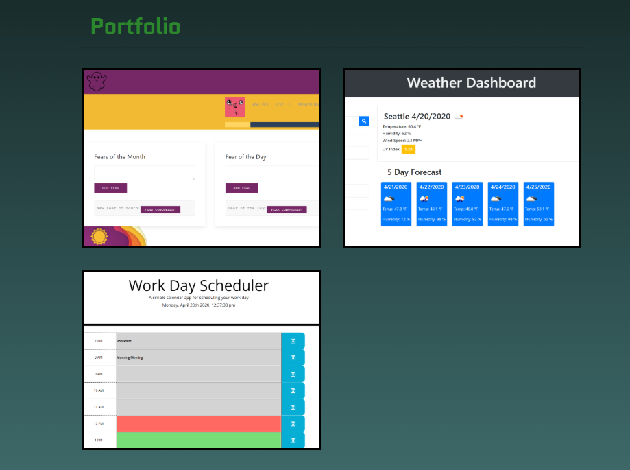
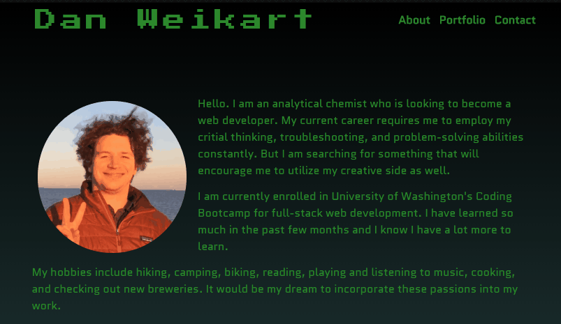

# Portfolio

## Description

Here is my portfolio built with React. I converted my current portfolio into a react application. I will be updating as I learn even more.

https://thedanitor.github.io/portfolio/

## Highlights

Since all I know at this point is HTML, CSS, and JavaScript I thought I would highlight some of my skills by adding animations. Here is what it looks like when the page first loads.

There are more animations than that. Can you find them all?

Below the About section is the portfolio itself.

The footer of the page contains all the links to get in touch with me: email, github, linkedIn, and a pdf of my resume.

Using Bootstrap has greatly benefitted the responsiveness of the site, although it can be difficult to override some of the Bootstrap stylings.

## Acknowledgement

Author Dan Weikart would like to thank everyone in his UW Coding Bootcamp class for helping improve his proficiency of HTML, CSS, JavaScript, and jQuery.

Special shoutout to tutor Namita Shenai, instructor John Young and TA's Abdul Aziz and Ben Vaagen.

The following websites/tutorials were very useful for learning some of the animation effects. 

https://css-tricks.com/snippets/css/typewriter-effect/

https://www.w3schools.com/css/css3_animations.asp

https://developer.mozilla.org/en-US/docs/Web/CSS/animation

https://github.com/FortAwesome/react-fontawesome#build-a-library-to-reference-icons-throughout-your-app-more-conveniently

https://dev.to/hunterbecton/react-tutorial-change-state-with-react-hooks-and-mouse-events-1g3m

This project was bootstrapped with [Create React App](https://github.com/facebook/create-react-app).
